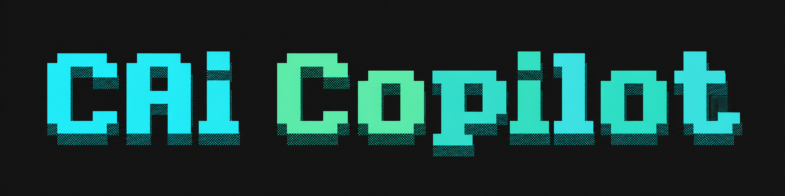

# CAi Molecule Design Copilot

An agentic platform for molecular generation, evaluation, and candidate prioritization.

[English](./README.md) | [简体中文](./README_zh.md)

## Overview

CAi is an AI agent platform for drug discovery workflows. It combines a lightweight LangGraph-based execution engine with domain-specific tools for molecular generation, docking, toxicity prediction, and synthesizability assessment.

**Key design principles:**
- Mixed interaction — the agent can answer questions directly, execute code, or do both in one response
- Lean system prompt (~1,700 tokens) — only the tools you actually use
- Skills (SOPs) — pre-validated workflows loaded on demand, not baked into every prompt
- Clean two-layer architecture — `BaseAgent` handles execution, `A1pro` adds domain tools

## Architecture

```
BaseAgent  (core: LangGraph + LLM + REPL)
    └── A1pro  (domain: tools + skills + system prompt)
              └── Web UI  (FastAPI + static frontend)
```

See [docs/architecture.md](docs/architecture.md) for full details.

## Getting Started

### 1. Configure environment

Create `CAi/.env`. The agent auto-detects the provider from `LLM_MODEL`:

```bash
# Anthropic (claude-*)
LLM_MODEL=claude-sonnet-4-5-20250929
LLM_API_KEY=sk-ant-...

# OpenAI (gpt-*, o1-*, o3-*)
# LLM_MODEL=gpt-4o-mini
# LLM_API_KEY=sk-...

# DeepSeek (deepseek-*)
# LLM_MODEL=deepseek-chat
# LLM_API_KEY=sk-...

# Custom endpoint (SGLang / vLLM / corporate OpenAI-compatible proxy)
# LLM_MODEL=qwen2.5-72b
# LLM_BASE_URL=http://your-endpoint/v1/
# LLM_API_KEY=your_key_here   # or "EMPTY" for unauthenticated local servers

TOOL_SERVER_HOST=0.0.0.0
TOOL_SERVER_PORT=8001
```

### 2. Install dependencies

```bash
conda create -n CAi python=3.11
conda activate CAi
pip install -e .
```

### 3. Install tool environments

Each tool runs in its own Conda environment:

```bash
cd CAi/toolkit/server

# Install all tool environments
bash install_all.sh

# Or install specific tools only
bash install_all.sh vina scscore toxicity
```

Before starting, download tool source code from [Google Drive](https://drive.google.com/drive/folders/1tjYJrMcVJnMopzbTyrf9KskvAxg2Xfin?usp=sharing) and extract into `CAi/toolkit/server/tools/`.

### 4. Start the tool backend

```bash
# Run from the repo root:
python -m CAi.toolkit.server.app
# Listens on http://0.0.0.0:8001 — check http://localhost:8001/health
```

### 5. Launch the agent

```bash
python CAi/main.py
# Web UI at http://localhost:7001
```

## Interaction Modes

The agent supports three response modes:

| Mode | Example |
|---|---|
| Direct answer | "What is LogP?" → plain text explanation |
| Code execution | "Calculate SCScore for aspirin" → runs code, shows result |
| Mixed | "Analyze this molecule" → explains plan + executes analysis |

No more forced `<solution>` tags for every response.

## Example Prompts

**Scaffold-based analog generation**
```
Given the penicillin core scaffold CC1CSC2(NC(=O)*)C(=O)N2[C@H]1C(=O)O,
generate 10 analogs using LibINVENT and RNN-based scaffold generation,
then rank by SC score.
```

**De novo design**
```
Use HIV-1 protease (1HVR.pdb) as the target. Binding site center: [15.2, 23.5, 6.8].
Generate candidate molecules with RxnFlow and REINVENT4, then rank by Vina score.
```

**Molecule evaluation**
```
For the molecules generated above, predict toxicity and MIC values.
Summarize which candidates look most promising.
```

## File Structure

```
CAi_copilot/
├── CAi/
│   ├── config.py                    # Global configuration
│   ├── .env                         # Local environment variables
│   ├── main.py                      # Entry point
│   ├── CAi_agent/
│   │   ├── base.py                  # BaseAgent — LangGraph + LLM + REPL
│   │   ├── agent.py                 # A1pro — orchestrator
│   │   ├── prompt/                  # PromptBuilder + sections
│   │   ├── tools/                   # ToolRegistry + Scanner + ReplBridge
│   │   └── skills/                  # SOP Markdown files
│   ├── toolkit/                     # Agent-facing drug discovery tools
│   │   ├── client.py                # HTTP client for the tool server
│   │   ├── skill_helpers.py         # get_skill_content / list_available_skills
│   │   ├── functions/
│   │   │   ├── generation.py        # 6 molecule generators
│   │   │   └── evaluation.py        # 4 molecule evaluators
│   │   └── server/                  # Tool execution backend (FastAPI)
│   └── web_ui/
│       ├── backend/
│       │   ├── app.py               # FastAPI chat + file endpoints
│       │   ├── conversation_store.py
│       │   └── pdf_export.py        # Conversation → Markdown → PDF
│       └── frontend/                # Static HTML/JS/CSS
├── base_CAi/                        # LLM factory + code execution utilities
└── docs/
    └── architecture.md              # Detailed architecture documentation
```

## Tool Workflow

```
Agent (CAi/toolkit/functions/*.py)
    │  POST /run/{tool}/{action}
    ▼
Tool server (CAi/toolkit/server/app.py) → JobManager
    │  conda run -n <env> python run.py
    │  cwd = workspace/jobs/<uuid>/
    ▼
Tool (run.py) → result.json
    ▼
Agent receives result
```

## Available Tools

| Category | Tool | Function |
|---|---|---|
| Scaffold generation | RNN-based | `generate_scaffold_analogs` |
| Scaffold generation | LibINVENT | `generate_libinvent_decorations` |
| Scaffold generation | REINVENT4 LibInvent | `generate_molecules_reinvent4_libinvent` |
| De novo design | RXNFlow | `generate_molecules_for_pocket` |
| De novo design | REINVENT4 de novo | `generate_molecules_reinvent4_denovo` |
| Analog generation | REINVENT4 Mol2Mol | `generate_molecules_reinvent4_mol2mol` |
| Synthesizability | SC Score | `calculate_scscore` |
| Docking | AutoDock Vina | `perform_molecular_docking_vina` |
| Toxicity | HepG2 prediction | `predict_molecule_toxicity` |
| Antibacterial | MIC prediction | `predict_antibacterial_pmic` |

## Extending CAi

### Add a tool

1. Add a function to `CAi/toolkit/functions/generation.py` or `evaluation.py`
2. Re-export it from `CAi/toolkit/__init__.py` (and `functions/__init__.py`)
3. Restart or call `agent.reload_tools()`

```python
def my_tool(smiles: str) -> str:
    """One-line description shown in the agent's tool catalog."""
    ...
```

### Add a skill (SOP)

Create `CAi/CAi_agent/skills/my_workflow.md`. The filename becomes the skill ID.
See [docs/architecture.md](docs/architecture.md#adding-skills) for the Markdown format.

See [CAi/start.md](CAi/start.md) for the full development guide.

## Citation

```bibtex
@misc{cai_molecule_design_copilot_2026,
  author    = {Datalab},
  title     = {CAi Molecule Design Copilot},
  year      = {2026},
  month     = {May},
  publisher = {GitHub},
  note      = {An agentic platform for molecular generation, evaluation, and candidate selection}
}
```
